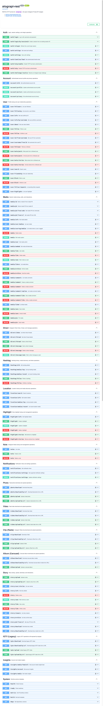

# aiograpi-rest

**RESTful HTTP service that wraps [`aiograpi`](https://github.com/subzeroid/aiograpi) (the async fork of `instagrapi`) so you can call Instagram's private API from any programming language.** Run it as a Docker sidecar next to your application; hit it from Node, Go, PHP, Java, C#, Ruby, Swift, Bash — anything that speaks HTTP.

This is the cross-language exit when your stack is not Python and the maintained Instagram libraries in your own language have gone stale or been archived (which, as of 2026, is most of them — see the [language-by-language survey](https://instagrapi.com/guides/instagram-api-libraries-by-language) on instagrapi.com).

Support chat on Telegram: https://t.me/aiograpi_support (the previous `@instagrapi` group was restricted by Meta and is no longer maintained)

## Why the project was renamed

Renamed from `instagrapi-rest` to `aiograpi-rest` in v1.0.0. The old name made
sense while the service wrapped synchronous `instagrapi`, but the service is now powered by `aiograpi`, the maintained async fork. The new name is more precise
for package managers, Docker images, OpenAPI clients, and repository discovery:
this project is the REST/HTTP boundary for `aiograpi`.

`aiograpi-rest` starts its own semver line at `1.0.0`. It is the renamed
successor of `instagrapi-rest 3.1.1`, not a continuation of the old package name
as `4.0.0`.

## Why this exists

`aiograpi` is the actively-maintained async Python wrapper for Instagram's private mobile API (the async fork of `instagrapi`) — full write surface (post, DM, story), pydantic-typed responses, first-class `challenge_required` and 2FA handling. If your application is in Python, you import it directly.

If your application is in a different language, your options for Instagram have been narrowing fast. The most-starred libraries on GitHub's [`instagram-api` topic](https://github.com/topics/instagram-api) are mostly stale or explicitly archived: the canonical Node/TypeScript client (`dilame/instagram-private-api`) hasn't shipped a meaningful release since August 2024; the canonical Go client (`ahmdrz/goinsta`) was archived in 2021; the Swift options are dead. Instagram's surface keeps moving and the per-language wrapper authors largely stopped chasing it.

`aiograpi-rest` solves that the simple way: run the actively-maintained async Python library (`aiograpi`) behind an HTTP boundary, and call it from whatever language you actually write your business logic in.

## What you still own

This is OSS infrastructure, not a managed service. Self-hosting means **you bring**:

- Instagram accounts (and the operational headache of keeping them un-banned)
- Residential or mobile proxies (Instagram's anti-abuse system flags datacenter IPs hard)
- Session storage and rotation
- Retry logic when challenges fire mid-script

If those line items sound like work you don't want, the same team behind `instagrapi` runs **[HikerAPI](https://hikerapi.com/p/7RAo9ACK)** as a managed equivalent — same Instagram surface, sessions and proxies handled on our side, called over HTTPS with an API key. It exists precisely because self-hosting `aiograpi-rest` has real ops cost. Use whichever fits — both paths are first-class.

## 30-second quick start

Current API version: `2.0.4`. Version 2 keeps the API intentionally strict:
`GET` for reads/downloads, `POST` for login and creates/uploads, `PATCH` for
state changes, and `DELETE` for removals or state reversal. Undo-style paths
such as `/media/unlike`, `/user/unfollow`, and `/media/unarchive` were removed
before the public API became widely used; use `DELETE /media/like`,
`DELETE /user/follow`, and `DELETE /media/archive`.

```bash
docker run -d -p 8000:8000 subzeroid/aiograpi-rest
```

Open http://localhost:8000/docs for the live OpenAPI / Swagger UI. Paste the
session id into the **Authorize** dialog once; protected routes use the
`X-Session-ID` header.

Get a session id (replace `<USERNAME>`/`<PASSWORD>`):

```bash
curl -X POST http://localhost:8000/auth/login \
  -H "Content-Type: application/x-www-form-urlencoded" \
  -d "username=<USERNAME>&password=<PASSWORD>"
```

Fetch a public profile:

```bash
curl "http://localhost:8000/user/info/by/username?username=instagram" \
  -H "X-Session-ID: <SESSIONID>"
```

Legacy `sessionid` query/form parameters are still accepted for existing
clients, but new integrations should use `X-Session-ID`.

Release artifacts are published from GitHub Actions: Docker images go to Docker
Hub and GHCR, Python packages go to PyPI through Trusted Publisher.

## Calling it from your language

The service is plain HTTP + JSON, so any HTTP client in any language works. Below are the shortest possible call snippets for the most common stacks; full working clients live in [`./golang`](golang) and [`./swift`](swift).

**Node.js / TypeScript:**

```js
const r = await fetch("http://localhost:8000/user/info/by/username?username=instagram", {
  headers: { "X-Session-ID": SID },
});
const user = await r.json();
console.log(user.full_name, user.follower_count);
```

**Go** (full example: [`golang/client.go`](golang/client.go)):

```go
req, _ := http.NewRequest("GET", "http://localhost:8000/user/info/by/username?username=instagram", nil)
req.Header.Set("X-Session-ID", sid)
resp, _ := http.DefaultClient.Do(req)
defer resp.Body.Close()
var user map[string]any
json.NewDecoder(resp.Body).Decode(&user)
```

**PHP:**

```php
$ctx = stream_context_create(["http" => ["header" => "X-Session-ID: $sid\r\n"]]);
$user = json_decode(file_get_contents(
  "http://localhost:8000/user/info/by/username?username=instagram",
  false,
  $ctx
), true);
```

**Java** (with `java.net.http.HttpClient`):

```java
HttpResponse<String> r = HttpClient.newHttpClient().send(
  HttpRequest.newBuilder(URI.create("http://localhost:8000/user/info/by/username?username=instagram"))
    .header("X-Session-ID", sid)
    .build(),
  HttpResponse.BodyHandlers.ofString());
```

**Ruby:**

```ruby
require "net/http"; require "json"
uri = URI("http://localhost:8000/user/info/by/username?username=instagram")
req = Net::HTTP::Get.new(uri); req["X-Session-ID"] = sid
user = JSON.parse(Net::HTTP.start(uri.hostname, uri.port) { |http| http.request(req) }.body)
```

**Swift** (full example: [`swift/client.swift`](swift/client.swift)).

For typed client generation in C++, C#, F#, D, Erlang, Elixir, Nim, Haskell, Lisp, Clojure, Julia, R, Kotlin, Scala, OCaml, Crystal, Rust, Objective-C, Visual Basic, .NET, Pascal, Perl, Lua and others, see the [Generating client code](#generating-client-code) section below.

## Features

1. **Authorization** — login, 2FA, settings management
2. **Account** — account info, profile, profile picture, privacy
3. **Media** — info, comments, likes, saves, pins, archive, edit, delete
4. **Direct** — inbox, threads, messages, seen state
5. **Discovery** — hashtags, locations, user search, friendship, blocks, follow requests
6. **Video / Photo / IGTV / Reels / Album** — upload to feed and story, download
7. **Story / Highlights / Notes** — archive, viewers, highlights, notes
8. **Notifications / Insights** — inbox, notification settings, media and account insights

## Installation

Requires Python 3.13 for local installs. Dependencies are declared in `pyproject.toml` (the legacy `requirements.txt` is gone).

Install ImageMagick (required for photo upload):

```
sudo apt install imagemagick
```

Then comment the strict policy line in `/etc/ImageMagick-6/policy.xml`:

```xml
<!--<policy domain="path" rights="none" pattern="@*"/>-->
```

Run the prebuilt Docker image:

```
docker run -p 8000:8000 subzeroid/aiograpi-rest
```

Images are published automatically from GitHub releases and semver tags to
Docker Hub and GitHub Packages. An `X.Y.Z` tag publishes
`subzeroid/aiograpi-rest:X.Y.Z`, `:X.Y`, `:latest`, and the matching
`ghcr.io/subzeroid/aiograpi-rest` tags.

PyPI and GitHub Release artifacts are published from the same tag workflow,
including the built wheel, source distribution, and `openapi.json`.

GitHub Packages image:

```
docker run -p 8000:8000 ghcr.io/subzeroid/aiograpi-rest
```

Or clone and build locally:

```
git clone https://github.com/subzeroid/aiograpi-rest.git
cd aiograpi-rest
docker build -t aiograpi-rest .
docker run -p 8000:8000 aiograpi-rest
```

Or use Docker Compose (recommended for local dev):

```
docker compose up api
```

Or run without Docker (requires Python 3.13):

```
python3.13 -m venv .venv
. .venv/bin/activate
python3.13 -m pip install -U pip
python3.13 -m pip install -e ".[test]"
uvicorn main:app --host 0.0.0.0 --port 8000 --reload
```

## Usage

Live API documentation at http://localhost:8000/docs (Swagger UI):



Project documentation is built with MkDocs and published to GitHub Pages:
https://subzeroid.github.io/aiograpi-rest/

The generated [aiograpi method coverage report](docs/aiograpi-coverage.md)
answers whether REST routes cover every `aiograpi.Client` method. They do not:
`aiograpi-rest` exposes a focused subset and documents the uncovered methods.

### Get a session id

```
curl -X 'POST' \
  'http://localhost:8000/auth/login' \
  -H 'accept: application/json' \
  -H 'Content-Type: application/x-www-form-urlencoded' \
  -d 'username=<USERNAME>&password=<PASSWORD>&verification_code=<2FA CODE>'
```

### Upload photo

```
curl -X 'POST' \
  'http://localhost:8000/story/upload' \
  -H 'accept: application/json' \
  -H 'X-Session-ID: <SESSIONID>' \
  -H 'Content-Type: multipart/form-data' \
  -F 'file=@photo.jpeg;type=image/jpeg'
```

### Upload photo by URL

```
curl -X 'POST' \
  'http://localhost:8000/story/upload/by/url' \
  -H 'accept: application/json' \
  -H 'X-Session-ID: <SESSIONID>' \
  -H 'Content-Type: application/x-www-form-urlencoded' \
  -d 'url=https%3A%2F%2Fapi.telegram.org%2Ffile%2Ftest.jpg'
```

### Upload video

```
curl -X 'POST' \
  'http://localhost:8000/story/upload' \
  -H 'accept: application/json' \
  -H 'X-Session-ID: <SESSIONID>' \
  -H 'Content-Type: multipart/form-data' \
  -F 'file=@video.mp4;type=video/mp4'
```

### Upload video by URL

```
curl -X 'POST' \
  'http://localhost:8000/story/upload/by/url' \
  -H 'accept: application/json' \
  -H 'X-Session-ID: <SESSIONID>' \
  -H 'Content-Type: application/x-www-form-urlencoded' \
  -d 'url=https%3A%2F%2Fapi.telegram.org%2Ffile%2Ftest.MP4'
```

## Generating client code

The service exposes an OpenAPI spec at `/openapi.json`. Use [`@openapitools/openapi-generator-cli`](https://www.npmjs.com/package/@openapitools/openapi-generator-cli) to generate a typed client in any supported language:

```
openapi-generator-cli generate -g <language> -i http://localhost:8000/openapi.json --skip-validate-spec
```

`--skip-validate-spec` is sometimes needed for transient validator errors.

## Operating in production

When you start running this against a real Instagram surface — daily monitoring, multi-account orchestration, anything beyond ad-hoc — you will hit the same friction the Python world hits with `instagrapi` directly:

- **Account bans** — Instagram rotates abuse-detection rules; accounts that scraped fine last week get flagged this week.
- **Proxy hunting** — datacenter IPs are flagged on first contact; you need residential or mobile proxies, and you need to rotate them.
- **Sessions** — losing a session means re-logging in, which means the `challenge_required` cycle, which means manual SMS / email retrieval.

`aiograpi-rest` does not solve any of this — it just gives you HTTP access to the same library that hits the same wall. The honest options when you reach this point are:

1. **Build the ops layer yourself** — proxy pool, account warming, challenge-handler workers. This is real engineering, measured in weeks.
2. **Use [HikerAPI](https://hikerapi.com/p/7RAo9ACK)** — same Instagram surface as a managed HTTPS endpoint with an API key. Proxies and sessions handled on our side. The two products coexist deliberately: this repo is the OSS path; HikerAPI is the managed path. Pick whichever matches the cost shape you want.

## Related

- [`subzeroid/instagrapi`](https://github.com/subzeroid/instagrapi) — the underlying Python library
- [`subzeroid/aiograpi`](https://github.com/subzeroid/aiograpi) — async fork of `instagrapi`
- [`subzeroid/hikerapi-mcp`](https://github.com/subzeroid/hikerapi-mcp) — MCP server for HikerAPI (LLM tool surface)
- [instagrapi.com](https://instagrapi.com) — guides, integration recipes, error reference
- [HikerAPI](https://hikerapi.com/p/7RAo9ACK) — managed Instagram API
- [LamaTok](https://lamatok.com/p/43zuPqyT) — managed TikTok API
- [DataLikers](https://datalikers.com/p/S9Lv5vBy) — Instagram + TikTok cached datasets

## Testing

The offline test suite lives under `tests/` and runs with `pytest`.

Run all tests through Docker Compose:

```
docker compose run --rm test pytest --cov=. --cov-report=term-missing --cov-fail-under=100
```

A single test file:

```
docker compose run --rm test pytest tests/test_app_system.py
```

Locally (Python 3.13):

```
python3.13 -m pytest --cov=. --cov-report=term-missing --cov-fail-under=100
```

Optional live smoke tests against real Instagram accounts are gated by the `TEST_ACCOUNTS_URL` environment variable and are skipped by default:

```
TEST_ACCOUNTS_URL="https://example.com/accounts" python3.13 -m pytest tests/live -m live -o addopts='' -v
```

Generate and validate docs:

```
python3.13 scripts/generate_aiograpi_coverage.py
mkdocs build --strict
```

## Development

For debugging with the dev server bound:

```
docker compose run --service-ports api
```
